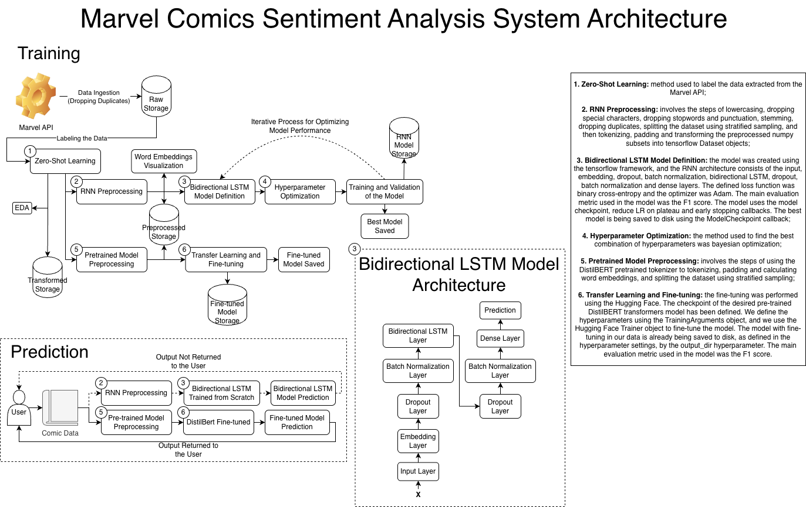

<a name="1"></a>
# Classificação de Sentimento dos Quadrinhos Marvel de Ponta a Ponta


* A publicação do artigo desse projeto no Medium foi separada entre 3 artigos. O 1° artigo aborda a etapa da ingestão, EDA e pré-processamento, o 2° artigo aborda a etapa da criação, treinamento e avaliação do modelo LSTM bidirecional, criando a visualização dos word embeddings, e o 3° artigo aborda a etapa do fine-tuning no modelo DistilBERT pré-treinado. **Artigos no Medium** desse projeto em português:
  * [Análise de Sentimentos Sobre os Quadrinhos da Marvel (Parte 1) - Ingestão, EDA e Pré-processamento](https://medium.com/@guineves.py/c5a0e35bb586);
  * [Análise de Sentimentos Sobre os Quadrinhos da Marvel (Parte 2) - LSTM Bidirecional](https://medium.com/@guineves.py/101ca13b92a6);
  * [Análise de Sentimentos Sobre os Quadrinhos da Marvel (Parte 3) - Fine-tuning do DistilBERT](https://medium.com/@guineves.py/2648e14c9123).
* Códigos completos desse projeto, com todas as explicações detalhadas em português: [notebooks](./notebooks);
  * Notebooks em inglês: [english notebooks](./notebooks/en_notebooks);
* Scripts completos desse projeto em inglês e em português: [src](./src/).

<a name="2"></a>
## Sobre
Gosto bastante de quadrinhos da Marvel de ação, mas, a Marvel tem muitos e nem todos são de ação. Portanto, decidi criar esse sistema que classificação cada quadrinho da Marvel, para então, eu conseguir decidir qual quadrinho irei ler.

Esse repositório contêm a implementação de um sistema de classificação de sentimentos utilizando 2 abordagens de previsão.
1. A primeira é uma arquitetura de uma RNN utilizando uma layer LSTM bidirecional, criadas e treinadas do 0;
2. A segunda é aplicando o fine-tuning em um modelo transformers pré-treinado.

O sistema foi criado de ponta a ponta, ou seja, desde a conexão e autorização com a [API da Marvel](https://developer.marvel.com/), extração dos dados da API, realização da análise exploratória e do pré-processamento dos dados, que envolve na conversão de todas as palavras para lowercase, remoção das stopwords, stemming, remoção de pontuações, divisão do dataset, tokenização e padding, e em seguida, a definição e treinamento do modelo, dado os quadrinhos classificados, posso escolher com mais clareza quais irei ler.



O algoritmo da RNN utilizando uma layer LSTM bidirecional foi criado utilizando o framework [tensorflow](https://www.tensorflow.org/?hl=pt-br). O algoritmo de fine-tuning no modelo transformers pré-treinado foi realizado utilizando o [Hugging Face](https://huggingface.co/) (🤗).

<a name="3"></a>
## Table of Contents
* [Classificação de Sentimento dos Quadrinhos Marvel de Ponta a Ponta](#1)
* [Sobre](#2)
* [Table fo Contents](#3)
* [Setup](#4)
   * [Dependências](#4.1)
   * [Instalação](#4.2)
   * [Variáveis de Ambiente](#4.3)
* [Execução](#5)

<a name="4"></a>
## Setup
<a name="4.1"></a>
### Dependências
* [python](https://www.python.org/);
* [pandas](https://pandas.pydata.org/);
* [numpy](www.numpy.org);
* [nltk](https://www.nltk.org/);
* [matplotlib](http://matplotlib.org);
* [tensorflow](https://www.tensorflow.org/);
* [scikit-learn](https://scikit-learn.org/stable/);
* [scikit-optimize](https://scikit-optimize.github.io/stable/);
* [pickle](https://docs.python.org/3/library/pickle.html);
* [transformers](https://huggingface.co/docs/transformers/index);
* [datasets](https://huggingface.co/docs/datasets/index).

<a name="4.2"></a>
### Instalação
```terminal
git clone https://github.com/guidasneves/marvel_sentiment_analysis.git
cd marvel_sentiment_analysis
pip install -r requirements.txt
```

<a name="4.3"></a>
### Variáveis de Ambiente
Definição das variáveis de ambiente no arquivo `.env`, necessárias para a execução do sistema.
```text
MARVEL_PUBLIC_KEY:"a public key para conexão e uso das APIs"
MARVEL_PRIVATE_KEY:"a private key para conexão e uso das APIs"
```

<a name="5"></a>
## Execução
Todos os scripts estão dentro do diretório [src](./src/), `./scr/`. Use os Jupiter Notebooks no diretório [notebooks](./notebooks/), `./notebooks/`, com a explicação completa e detalhada do sistema de cada etapa e o código completo de cada etapa.
